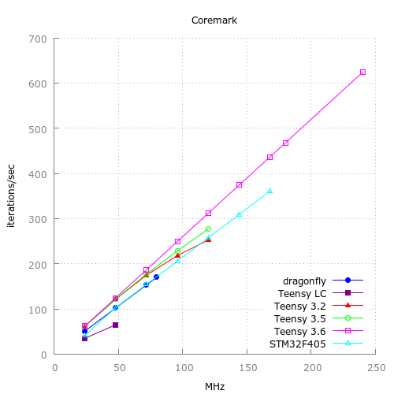
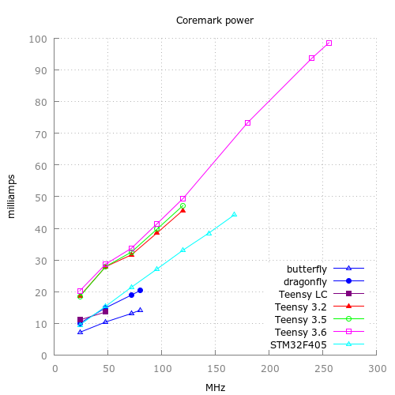

##  STM32F405 sketches and such 

adafruit STM32F405@168MHz https://www.adafruit.com/product/4382 

Board also supports circuitpython and micropython.

Files | Description
---|---
adcdma.ino | free-running ADC (A2) with DMA
adcinternal.ino  |   VBAT, VREF, temperature 
crc.ino | hardware CRC
dacdmahal.ino | timer controlled DAC output with circular DMA
mem2mem.ino | memory-to-memory DMA
rng.ino | hardware random number generator
rtc.ino |  RTC tests
spiperf.ino | SPI2 DMA

--------

Some performance comparisons at

   https://github.com/manitou48/DUEZoo

Reference
  https://www.adafruit.com/product/4382 
